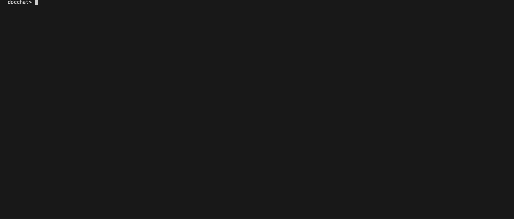

# DocChat

DocChat is a smart chatbot that allows users to ask questions about documents (HTML files, PDFs, webpages, or images).  
It detects the document's language automatically and can translate English questions into the appropriate language before answering intelligently.


---

## Demo



Example:
```markdown


## Example
$ python docchat.py myfile.html
docchat> What is this document about?
DOCCHAT: This document discusses the migration patterns of birds across North America.

docchat> How does the rocket engine work underwater?
DOCCHAT: Sorry, this document does not contain information about underwater rocket engines.
